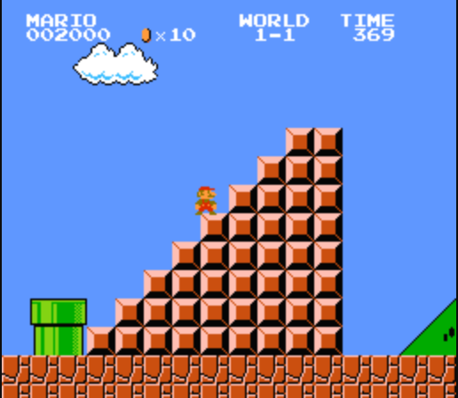

# Escalier Mario

Chaque niveau de maro se termine par un escalier.

Exemple:



Cette escalier peut être de hauteur variable.

Ecrire un programme qui demande une taille à l'utilisateur et affiche un escalier de la taille voulue dans le terminal en utilisant le caractère `#`
Si un hauteur négative ou nulle est renseignée, votre programme doit afficher "IMPOSSIBLE"

Exemples :
* escalier de taille 3
```
    ##
   ###
  ####
```
* escalier de taille 5
```
      ##
     ###
    ####
   #####
  ######
```
* escalier de taille -3
```
IMPOSSIBLE
```
